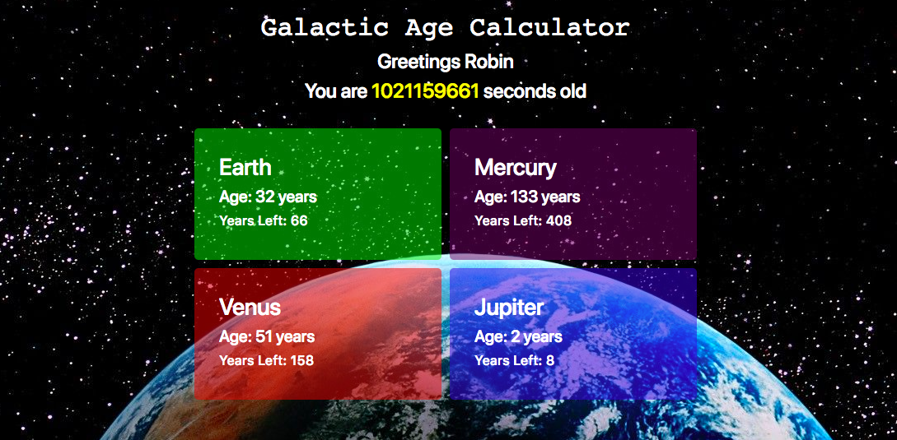

# Space Age Calculator
##### Robin Sola // April 2018
---
###### Live Site:
https://galactic-calculator.firebaseapp.com/

## Description
An application that takes your age and converts it to how old you would be at certain locations in outer space. Calculate your age in seconds. Find out how old you would be on Mercury, Venus, Mars, or Jupiter. Determine how many years you have left to live on each planet!
## Specs
|behavior|input|output|
|--------|-----|------|
|convert birthdate to age in Earth years|03-20-1986|32|
|calculate seconds between two dates|03-20-1986, 04-20-2018|1012565762.389|
|convert Earth years to seconds|32|1009152000|
|convert Earth years to Mercury years|32|133|
|convert Earth years to Venus years|32|51|
|convert Earth years to Mars years|32|17|
|convert Earth years to Jupiter years|32|2|
|calculate life expectancy for Mercury|81|337|
|calculate life expectancy for Venus|81|130|
|calculate life expectancy for Mars|81|43|
|calculate life expectancy for Jupiter|81|6|
## Installation
* Clone project folder: `$ git clone` repository
* Open terminal and run `$ npm install` in project home directory
* run `$ npm start` to view in browser
## Known Bugs
No known bugs
## Contact
Contact me through github with comments/questions.
## Technologies Used
* npm/Webpack
* HTML
* CSS/BOOTSTRAP
* JavaScript/JQUERY
* Tested with Jasmine/Karma.

### License
##### Copyright (c) 2018 Robin Sola.
Permission is hereby granted, free of charge, to any person obtaining a copy of this software and associated documentation files (the "Software"), to deal in the Software without restriction, including without limitation the rights to use, copy, modify, merge, publish, distribute, sublicense, and/or sell copies of the Software, and to permit persons to whom the Software is furnished to do so, subject to the following conditions:

The above copyright notice and this permission notice shall be included in all copies or substantial portions of the Software.

THE SOFTWARE IS PROVIDED "AS IS", WITHOUT WARRANTY OF ANY KIND, EXPRESS OR IMPLIED, INCLUDING BUT NOT LIMITED TO THE WARRANTIES OF MERCHANTABILITY, FITNESS FOR A PARTICULAR PURPOSE AND NONINFRINGEMENT. IN NO EVENT SHALL THE AUTHORS OR COPYRIGHT HOLDERS BE LIABLE FOR ANY CLAIM, DAMAGES OR OTHER LIABILITY, WHETHER IN AN ACTION OF CONTRACT, TORT OR OTHERWISE, ARISING FROM, OUT OF OR IN CONNECTION WITH THE SOFTWARE OR THE USE OR OTHER DEALINGS IN THE SOFTWARE.
